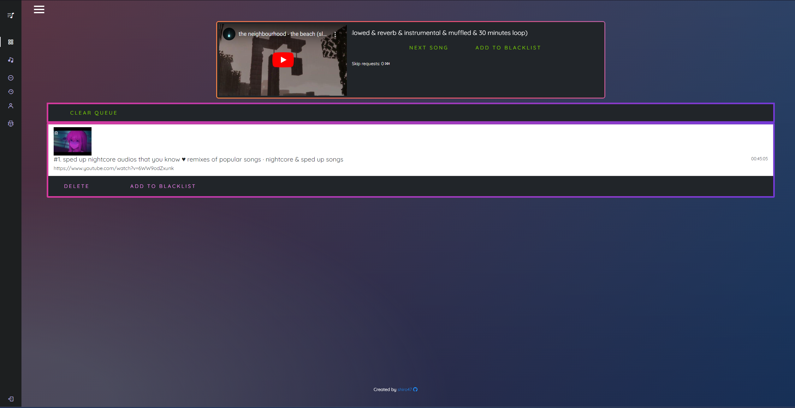
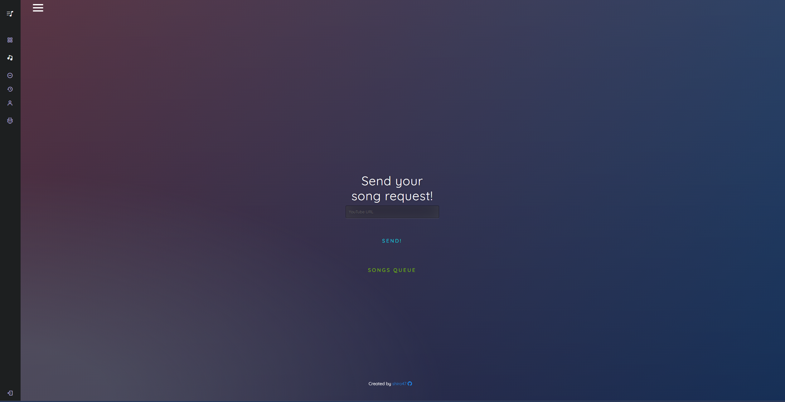
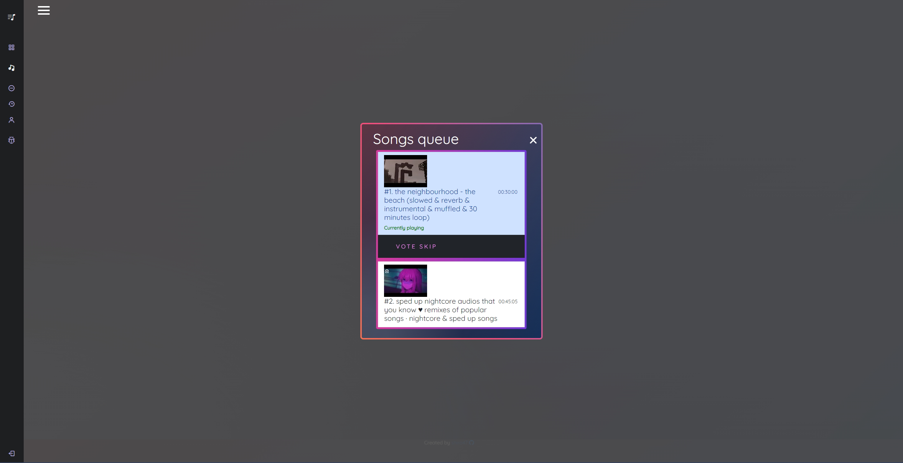
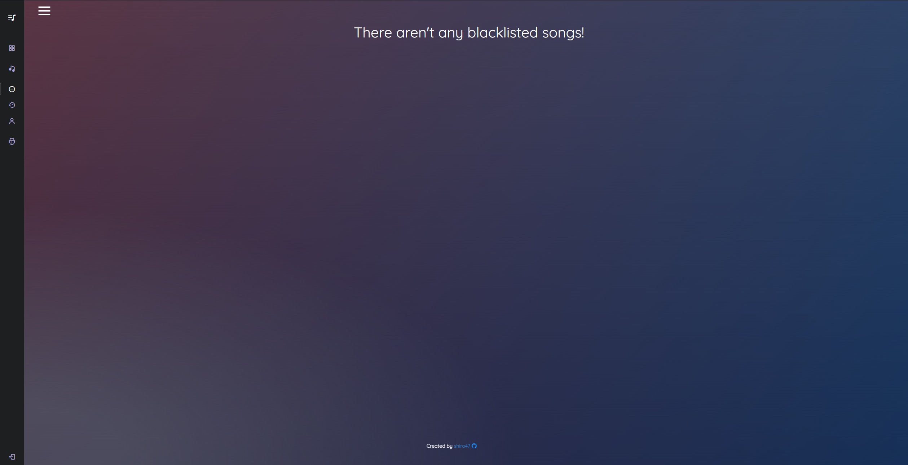
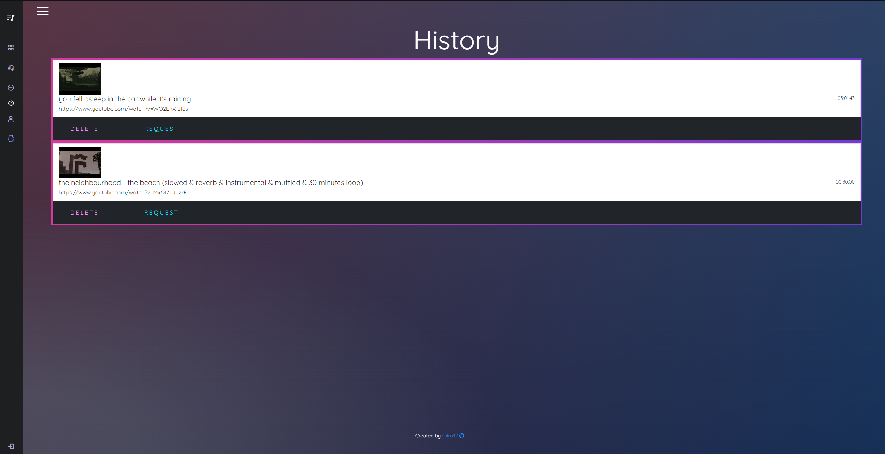
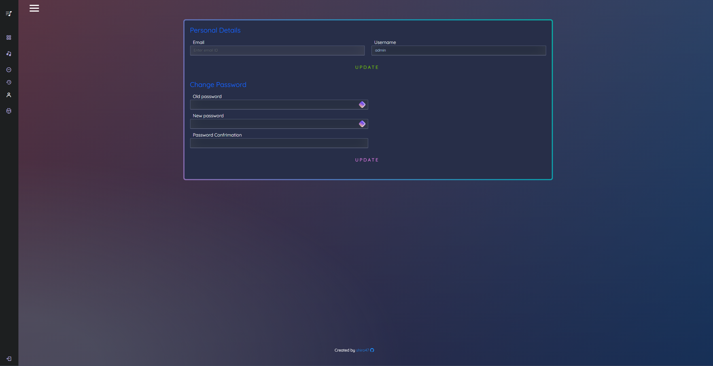

# ZS12 Music (SONG REQUEST)

This is a comprehensive song request application built on the Django framework and powered by Redis (for websockets). It offers a variety of essential functions, including the ability to request songs directly from YouTube, manage the songs queue, and an intuitive admin system for efficient management.

## Demo

Admin login:

- Username: **admin**

- Password: **admin**

##
User login:

- Username: **user**

- Password: **userr123**

##
Main page:

https://zs-song-request.herokuapp.com/

Admin page:

https://zs-song-request.herokuapp.com/admin

## Tech Stack

**Client:** HTML, CSS, JS, JQuery, Bootstrap, AJAX

**Server:** Django, Websockets, Redis, SQLite3, Google API

## Features

**ZS12 Music** offers a plethora of features that are designed to provide the ultimate music request experience. Some of the key features of this application include:

- YouTube link validation: With this feature, you can be sure that every song request is a valid YouTube link.

- Secure login system: The login system ensures that only the admin can register an account, ensuring that the system remains secure at all times.

- Intuitive admin panel: The admin panel is a powerful tool that allows you to manage the songs queue in real-time via websockets, ensuring that your music never stops.

- Songs history list: Keep track of all the songs that have been played in the past, so you can easily find and play them again.

- Blacklist for songs: If there are any songs that you don't want to hear, you can add them to the blacklist and they will never be played again.

- Account management page: This feature allows you to manage your account settings, including changing your password and updating your profile information.

- Bug report system: If you encounter any issues while using the application, you can easily report them via the bug report system.

- Skip votes for song system: If you're not feeling a particular song, you can vote to skip it and move on to the next one. This feature ensures that everyone gets to enjoy the music they love.

- Configuration File for Limiting the Number of Songs Users can Add within a Specific Time Period: This feature enables the customization of the number of songs that users can add to the queue within a particular time frame. With the use of a configuration file, the administrator can easily adjust this limit to fit their preferences and requirements. This provides better control over the song request process and ensures a fair and enjoyable experience for all users.

## Screenshots

- Dashboard

- Request song

- Songs queue

- Songs blacklist

- Songs history

- Profile panel

## Badges

